# Manual Técnico

## Objetivos
### Objetivo General
desarrollar una plataforma de libros electrónicos en la nube similar a Kindle, que fomente la lectura entre los guatemaltecos.
### Objetivos especifícos
- Autenticación de usuarios: Implementar un sistema de login y registro de usuarios.
- Gestión de libros: Permitir a los administradores cargar, actualizar y eliminar libros.
- Experiencia de usuario: Crear una interfaz intuitiva donde los usuarios puedan buscar, adquirir y leer libros.
- Infraestructura escalable: Desplegar la aplicación en AWS usando servicios como S3, EC2, RDS, y un balanceador de carga.
- Seguridad: Asegurar las contraseñas mediante encriptación y controlar los accesos mediante IAM.
- Documentación: Elaborar un manual técnico y un manual de usuario.

## Explicación de Arquitectura del proyecto.

### Cliente y Frontend
- Los usuarios acceden a la plataforma desde sus dispositivos (PC, móvil, tablet).
- El frontend está alojado en Amazon S3, lo que permite servir la aplicación web de manera eficiente y con alta disponibilidad.
- El frontend se comunica con el backend a través de un Classic Load Balancer

### Balanceador de Carga (Classic Load Balancer)
- Se utiliza un Classic Load Balancer para distribuir las solicitudes entre los servidores backend, asegurando que ninguna instancia se sobrecargue.
- Esto mejora la escalabilidad y disponibilidad de la plataforma.

- Backend con Node.js y Python
- Node.js: Es la misma implementación solo que en el lenguaje js.
- Python: Es la misma implementación solo que en el lenguaje python.
- Ambas aplicaciones están desplegadas en instancias EC2 y tienen acceso seguro a los demás servicios mediante IAM.  

### Almacenamiento en Amazon S3
- Fotos: Para almacenar imágenes de portadas de libros, avatares de usuarios, etc.
- Libros: Para almacenar los archivos digitales de los libros en formatos como PDF o EPUB.
- El backend tiene permisos para gestionar estos archivos de forma segura.

### Base de Datos en Amazon RDS
- Se utiliza Amazon RDS como base de datos relacional, lo que sugiere que maneja información estructurada de usuarios, libros, compras, etc.
- El backend interactúa con RDS para realizar operaciones CRUD de datos.
- Se implementa IAM para gestionar el acceso seguro a la base de datos.

## Diagrama Entidad Relación
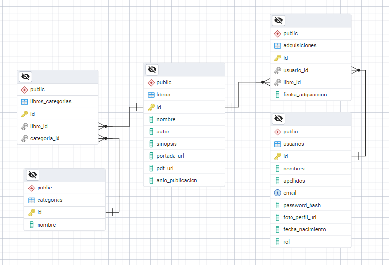

### Implementación de RDS en AWS

## Descripción de cada usuario de IAM creado con las políticas asociadas.

### Grupos de seguridad

#### *ec2_s3* 
Se creo un grupo de politicias las cuales tienen acceso completo a:
1. EC2
2. S3
3. Elastic Load Balancer
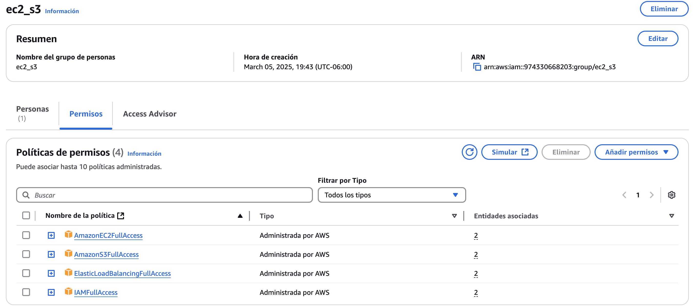

#### *ec2_rds*
Se creo un grupo de políticas las cuales tienen acceso completo a:
1. EC2
2. RDS
3. S3
4. Load Balancer

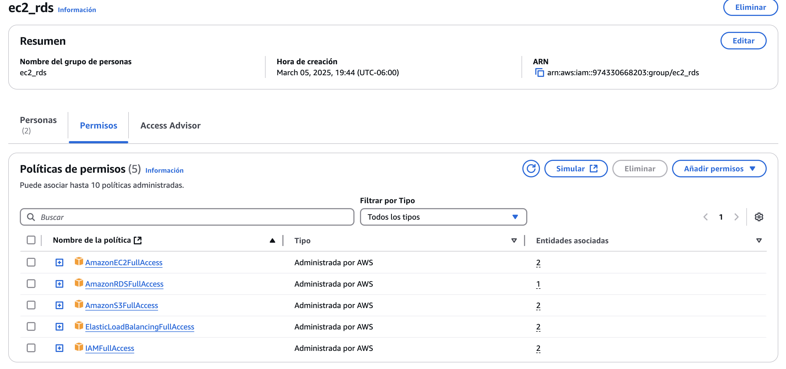

### Usuarios de IAM

Se cuenta con tres usuarios que comparten grupos de políticas:

1. backend2_p1 
   1. Comparte el grupo de políticia *ec2_rds*
2. usuario1_p1
   1. Comparte el grupo de política *ec2_s3*
3. usuario2_p1
   1. Comparte el grupo de politica *ec2_rds*

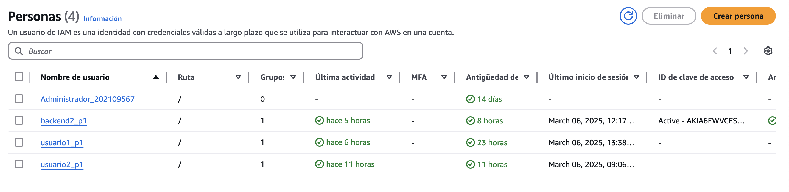

## Capturas y descripción de cómo se configuró cada servicio.

### Configuración de las EC2 para las instancias de lso servicios backend

1. Se crearon dos instancias en EC2, utilizando Ubuntu como SO y todas opciones de las capa gratuita.
   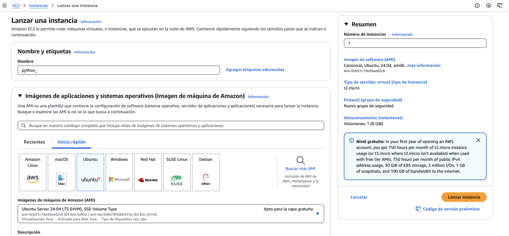
   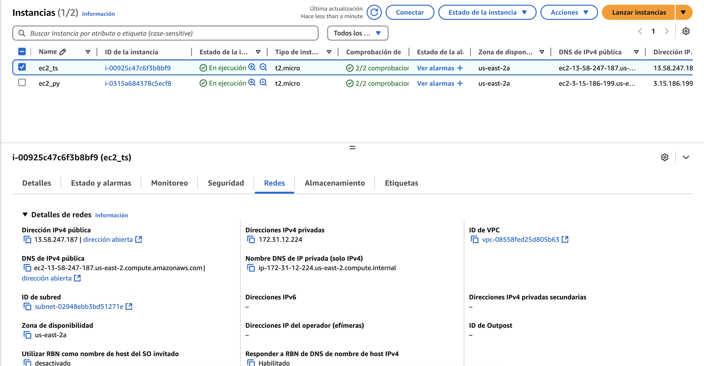
   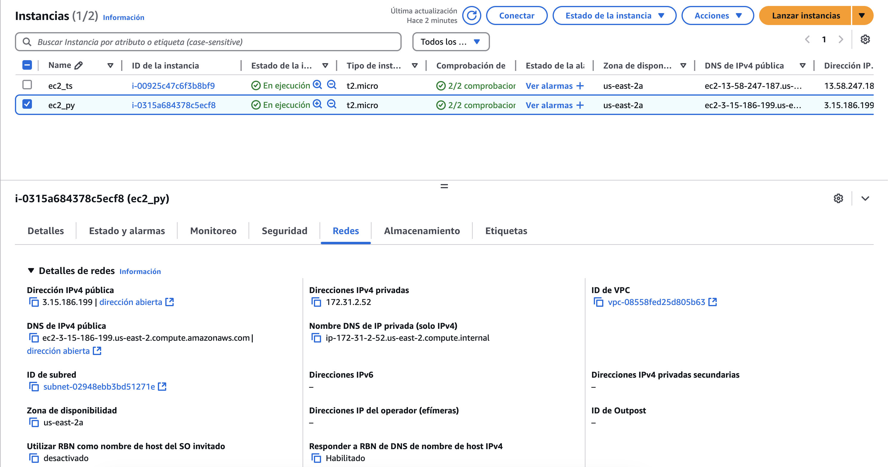 
2. Se configuraron los accesos de red para disponer hacia todas las máquinas el puerto *3001*, donde los servicios de python y node_js se están ejecutando. 
   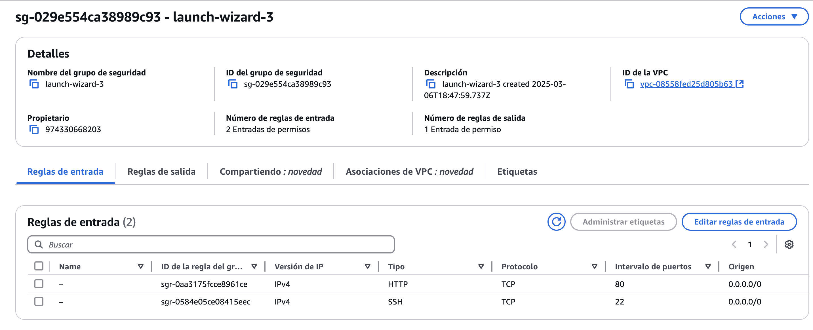

### Configuración del Load Balanacer
Se configuró un Load Balancer el cual tiene atada las dos intancias EC2 que se crearon para cada servicio estas, están unidas por el mismo puerto *3001*.
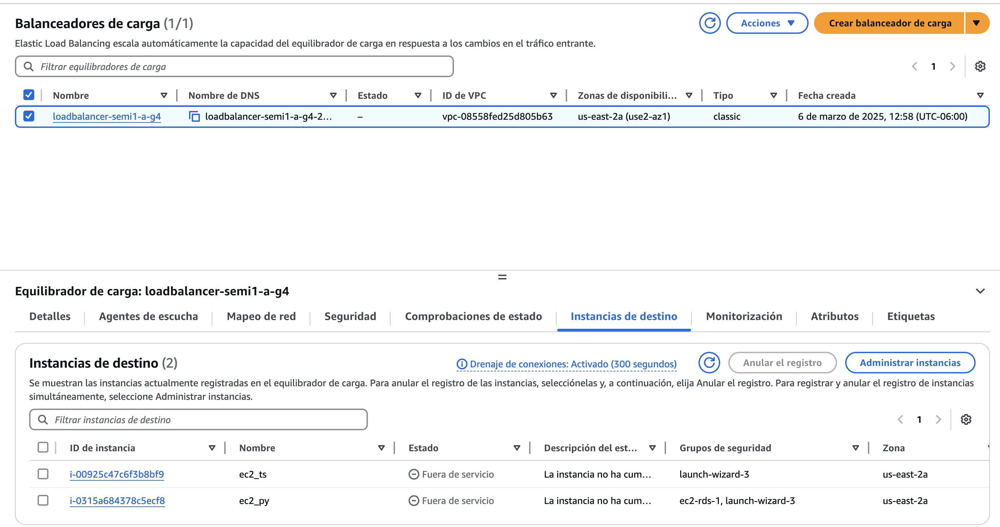

### Configuracion de S3
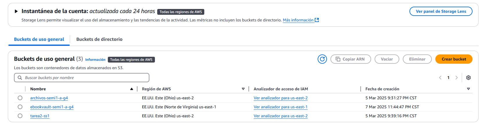
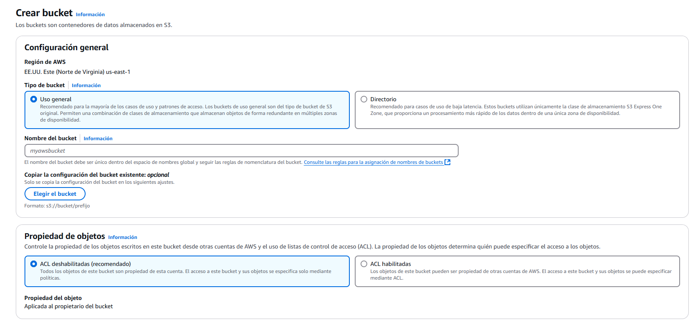
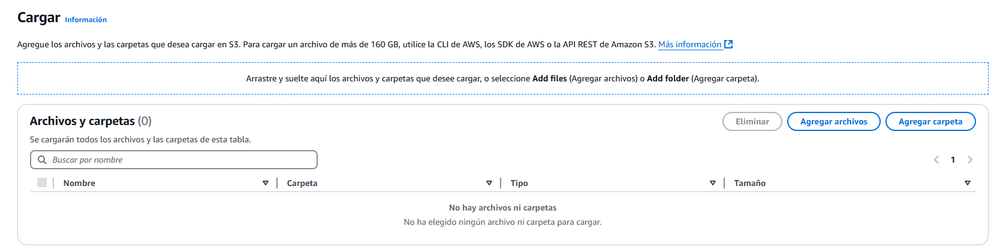
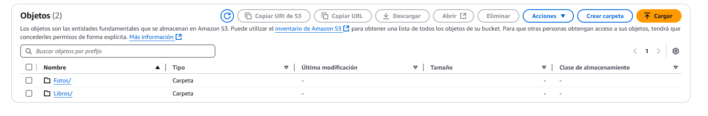
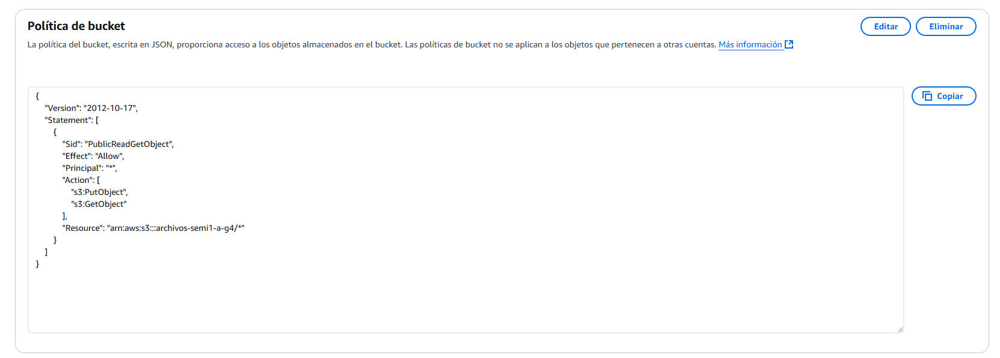
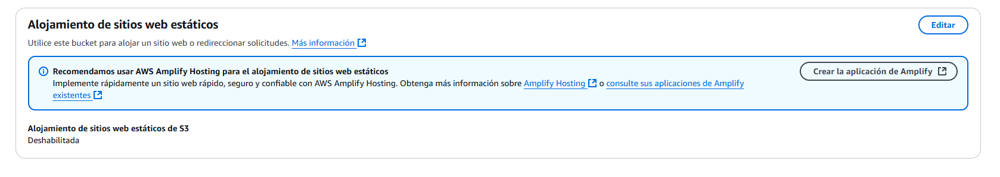
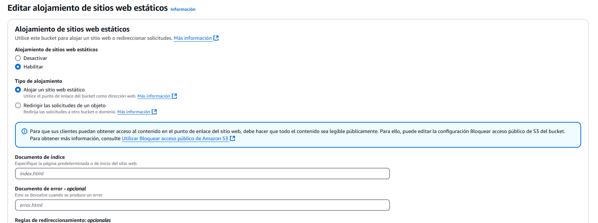
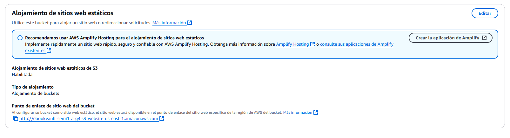

### Configuracion RDS
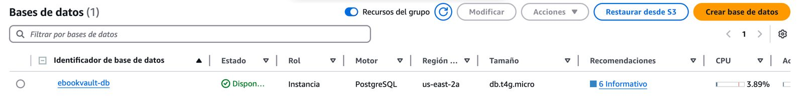

## Conclusiones
- El proyecto EbookVault representa una solución efectiva y escalable para la lectura digital en Guatemala, aprovechando la infraestructura en la nube de AWS para garantizar disponibilidad y accesibilidad. La elección de servicios como S3, EC2 y RDS permite gestionar eficientemente los recursos y datos de la aplicación.

- El uso de Amazon S3 para almacenar tanto la aplicación web como los archivos de los libros mejora la eficiencia en la entrega de contenido, reduciendo la carga en los servidores backend y permitiendo un acceso rápido a los libros digitales.

- La separación de roles entre usuarios normales y administradores facilita la gestión del sistema, permitiendo que los administradores controlen el catálogo de libros mientras los usuarios pueden explorar, adquirir y leer contenido de manera sencilla.