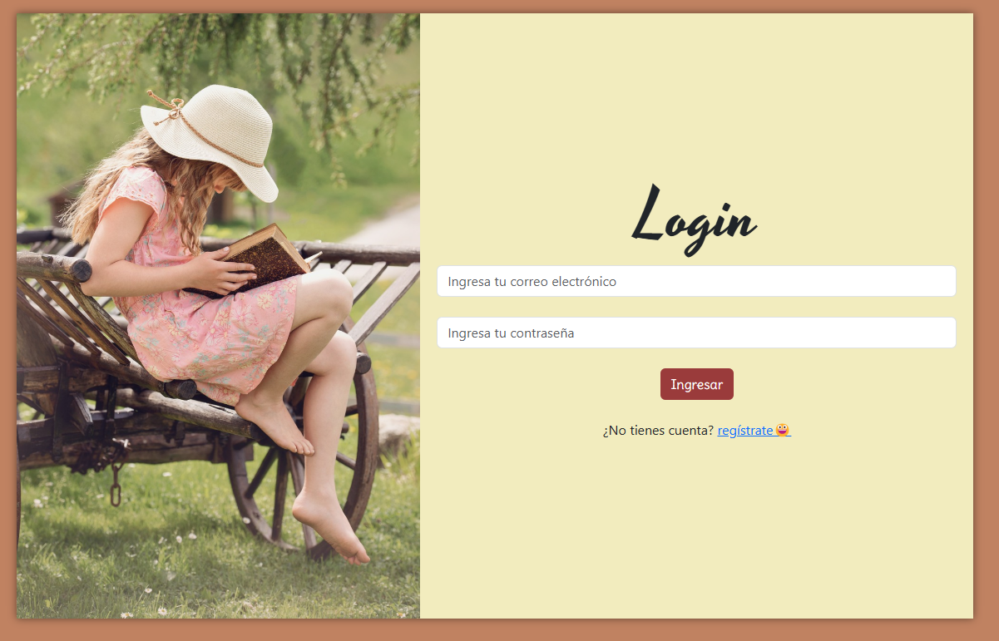
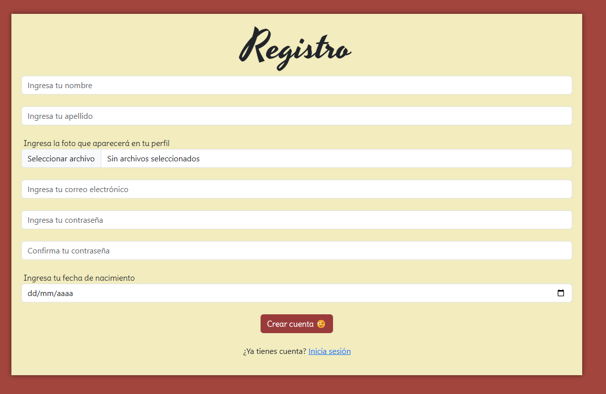
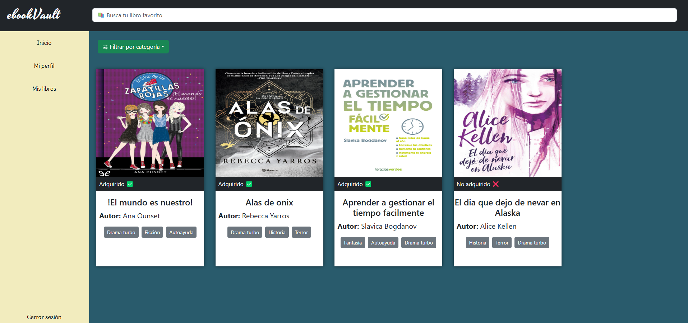
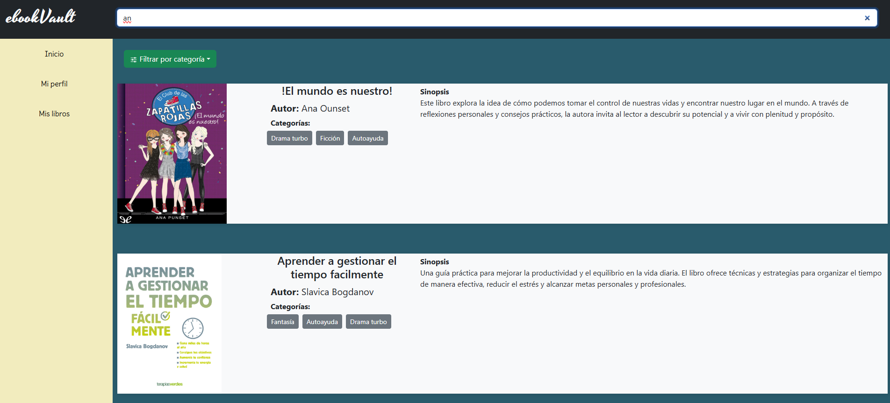
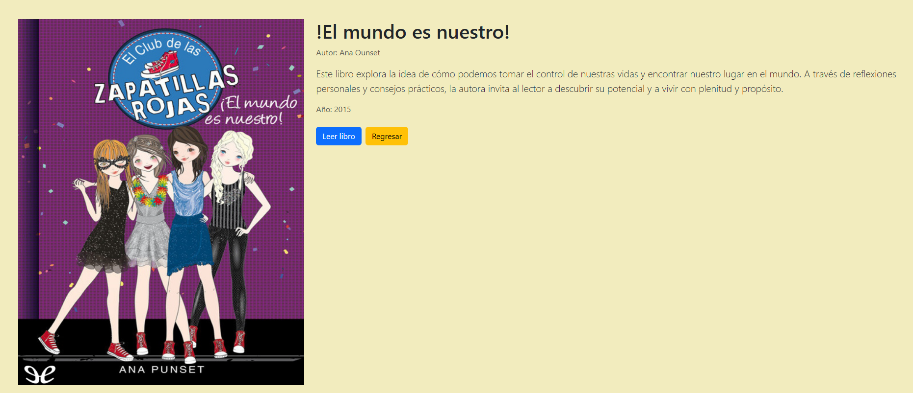
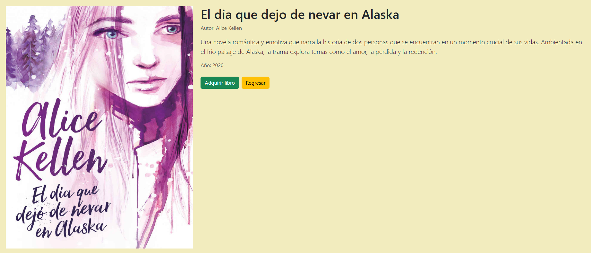
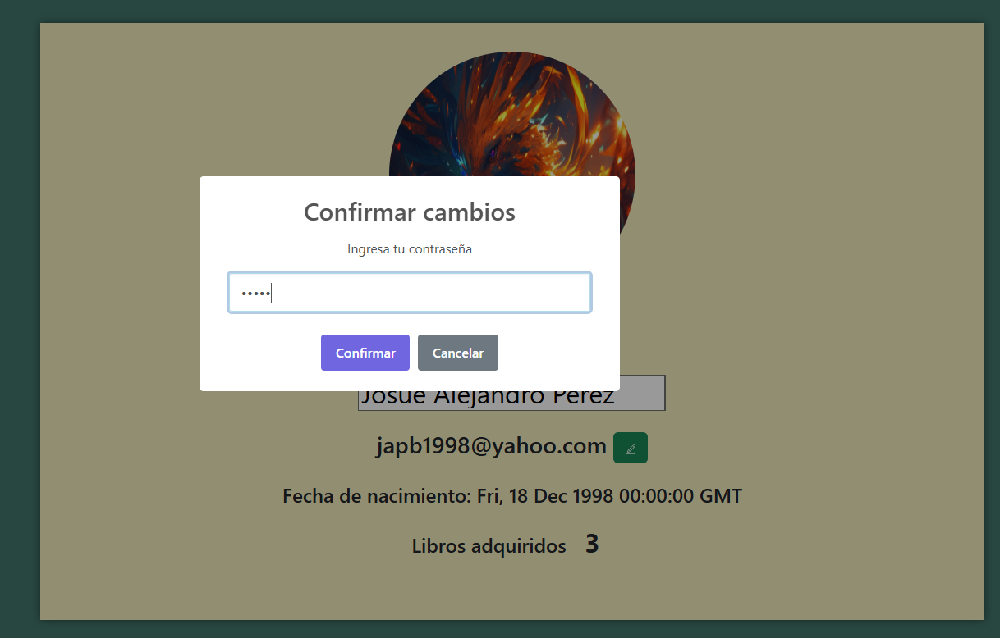

**Manual de Usuario**  

**Objetivos del Manual**  
El presente manual tiene como objetivo principal brindar a los usuarios una guía clara y detallada que les permita utilizar de manera adecuada y eficiente la aplicación. A través de este documento, se busca:  
1. Presentar una descripción general de la aplicación, sus funciones y herramientas disponibles.  
2. Explicar las diferentes vistas y opciones con las que el usuario podrá interactuar.  
3. Familiarizar al usuario con la aplicación, proporcionándole las habilidades necesarias para realizar operaciones de manera intuitiva y sin errores.  

**Explicación y descripción de la aplicación**  
La aplicación que presentamos ofrece un servicio especializado en la adquisición y gestión de libros de manera virtual. Entre sus principales funcionalidades se encuentran:  
- Almacenamiento virtual de libros, lo que permite a los usuarios acceder a su biblioteca sin ocupar espacio en sus dispositivos.  
- Acceso al contenido de los libros adquiridos desde cualquier lugar y en cualquier momento.  
- Herramientas de búsqueda avanzada para facilitar la localización de libros específicos.  

**Pasos para utilizar la aplicación**  

1. **Iniciar sesión y registrarse**  
   - Al acceder a la aplicación, el usuario podrá iniciar sesión con sus credenciales o registrarse si es la primera vez que utiliza el servicio.  
   

   

2. **Menú principal**  
   - Una vez dentro de la aplicación, el usuario ingresará al menú principal, el cual cuenta con:  
     - Una barra de búsqueda en la parte superior para realizar búsquedas rápidas.  
     - Una barra lateral en el lado izquierdo con las siguientes opciones:  
       - **Inicio**: Muestra una vista general de la biblioteca disponible.  
       - **Perfil**: Permite al usuario visualizar y modificar su información personal. Para realizar cambios, se solicitará la contraseña como medida de seguridad.  
       - **Mis libros**: Muestra exclusivamente los libros adquiridos por el usuario, facilitando su acceso y lectura.  
       - **Cerrar sesión**: Permite al usuario salir de la aplicación de manera segura.  

    

    

3. **Navegación y selección de libros**  
   - Al seleccionar un libro desde el menú **Inicio** o **Mis libros**, el usuario será dirigido a una pantalla de adquisición (en caso de no haberlo comprado) o a la pantalla de lectura (si ya lo ha adquirido).  

   

   

4. **Gestión del perfil**  
   - En el menú **Perfil**, el usuario podrá:  
     - Visualizar la información de su cuenta activa.  
     - Realizar modificaciones en su perfil, como actualizar su nombre, correo electrónico u otros datos. Para confirmar los cambios, se requerirá que ingrese nuevamente su contraseña.  

     
     
     

     