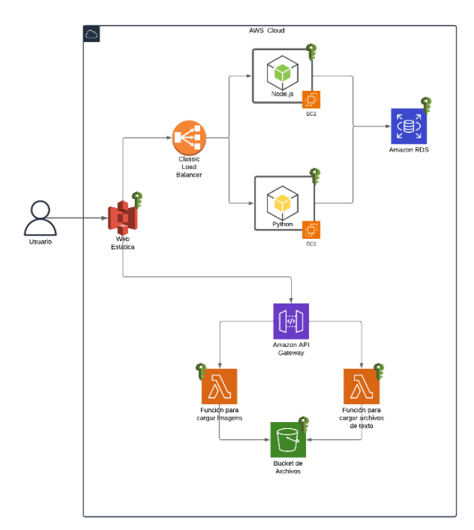
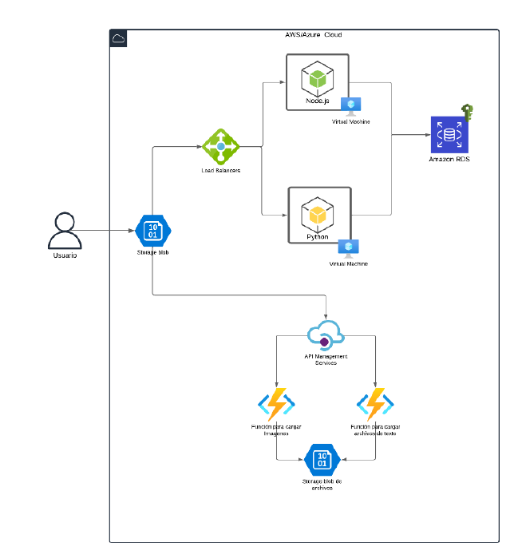

# Manual tecnico de la aplicacion

## Integrantes del grupo 4

| Nombre           | Carnet     |
|------------------|------------|
| Alvaro Garcia    | 202109567  |
| Marco Sebastian  | 202004822  |
| Josué Porres     | 202112026  |
| Jhonatan Aguilar | 202106003  |
| Alejandro Perez  | 201712602  |

## Arquitectura AWS

### Componentes principales:
1. **Frontend (Aplicación Web Estática)**
   - Desarrollado con Node.js
   - Alojado en un bucket S3 público con nombre: `practica2SemilA1s2025paginawebg4`
   - Se conecta al balanceador de carga de AWS

2. **Backends**
   - **Backend 1**: Desarrollado en ASP.NET
   - **Backend 2**: Desarrollado en TypeScript
   - Ambos implementados en instancias EC2
   - Cada servidor tiene su propia configuración de grupo de seguridad

3. **Almacenamiento**
   - **Amazon S3** para archivos de usuarios:
     - Bucket público: `practica2semilA1s2025Archivosg4`
     - Almacena imágenes y archivos de texto
     - URLs de los objetos se almacenan en RDS
   - **Amazon RDS** (MySQL):
     - Almacena información de usuarios (credenciales encriptadas)
     - Almacena datos de tareas
     - Almacena URLs de los archivos en S3 (no los archivos directamente)

4. **Serverless**
   - **AWS Lambda**:
     - Función para cargar imágenes
     - Función para cargar documentos de texto
   - **API Gateway**:
     - Configurado para exponer las funciones Lambda
     - Rutas para cada tipo de operación

5. **Balanceo de Carga**
   - **AWS Elastic Load Balancer (ELB)**
   - Distribuye tráfico entre las dos instancias EC2
   - Tolerancia a fallos: si un servidor cae, el tráfico se redirige al otro

6. **Gestión de Accesos**
   - **IAM**:
     - Usuarios con políticas específicas para cada servicio
     - Políticas mínimas necesarias para cada componente

## Arquitectura Azure

### Componentes principales:
1. **Frontend (Aplicación Web Estática)**
   - Mismo código que en AWS (Node.js)
   - Alojado en un Blob Container público con nombre: `practica2SemilA1s2025paginawebg4`
   - Se conecta al balanceador de carga de Azure

2. **Backends**
   - **Backend 1**: Desarrollado en ASP.NET (mismo que en AWS)
   - **Backend 2**: Desarrollado en TypeScript (mismo que en AWS)
   - Implementados en Azure Virtual Machines (VMs)
   - Configuración de seguridad específica para cada VM

3. **Almacenamiento**
   - **Azure Blob Storage** para archivos de usuarios:
     - Blob Container público: `practica2semilA1s2025Archivosg4`
     - Almacena imágenes y archivos de texto
     - URLs de los objetos se almacenan en la misma base de datos RDS de AWS
   - **Amazon RDS** (MySQL) (compartido con AWS):
     - Misma base de datos que en la implementación AWS
     - Almacena toda la información de usuarios, tareas y URLs de archivos

4. **Serverless**
   - **Azure Functions**:
     - Función para cargar imágenes
     - Función para cargar documentos de texto
   - **API Management**:
     - Configurado para exponer las Azure Functions
     - Rutas equivalentes a las de AWS

5. **Balanceo de Carga**
   - **Azure Load Balancer**
   - Distribuye tráfico entre las dos VMs
   - Tolerancia a fallos similar a la solución AWS

## Usuarios IAM y politicas de acceso

### 1. Administrador_202109567
- **Políticas asignadas**:
  - AmazonAPIGatewayAdministrator: Acceso completo a API Gateway
  - AmazonRekognitionFullAccess: Acceso completo a Rekognition (servicio de visión por computadora)
  - AWSLambda_FullAccess: Acceso completo a AWS Lambda
  - IAMFullAccess: Permite gestionar completamente el servicio IAM
  - IAMUserChangePassword: Permite cambiar su propia contraseña
- **Grupo**: ht2 (hereda políticas de este grupo)

### 2. usuario_1
- **Políticas asignadas**:
  - AmazonRDSFullAccess: Acceso completo a RDS (servicio de bases de datos)
  - AmazonS3FullAccess: Acceso completo a S3 (almacenamiento de objetos)
  - IAMFullAccess
  - IAMUserChangePassword
- **Grupo**: S3_RDS (hereda políticas de este grupo)

### 3. usuario_2 y usuario_3
Ambos usuarios tienen exactamente los mismos permisos:
- **Políticas asignadas**:
  - AmazonEC2FullAccess: Acceso completo a EC2 (servidores virtuales)
  - AmazonRDSFullAccess
  - AWSLambda_FullAccess
  - IAMFullAccess
  - IAMUserChangePassword
- **Grupo**: EC2_RDS_Lambda (hereda políticas de este grupo)

## Capturas de pantalla de los recursos utilizados
### AWS
#### 1. **Buckets de Amazon S3**
#### 2. **Instancias de EC2**
#### 3. **Balanceador de carga de EC2**
#### 4. **Base de datos de RDS**
#### 5. **Funciones Lambda**
#### 6. **Configuración de Api Gateway**

### Azure

#### 1. **Blob Containers de Azure**
#### 2. **Instancias de VM de Azure**
#### 3. **Balanceador de carga de Azure**
#### 4. **Funciones de Azure Functions**
#### 5. **Configuración de Api Management**

## Diferencia entre arquitectura con **AWS** y **Azure**

1. **AWS**:
   - Mayor cantidad de servicios a configurar (IAM, EC2, S3, RDS, Lambda, API Gateway, ELB)
   - Requiere configuración detallada de políticas IAM
   - SDK de AWS bien documentado pero con curva de aprendizaje

2. **Azure**:
   - Menos componentes que configurar (no requiere equivalente a IAM con mismo nivel de detalle)
   - Integración más sencilla entre servicios
   - Interfaz de portal más unificada
   - Curva de aprendizaje menor para desarrolladores familiarizados con Microsoft

**Conclusión**: Ambas arquitecturas cumplen con los mismos requisitos funcionales pero con servicios diferentes. AWS ofrece mayor granularidad en controles de acceso (IAM) pero con mayor complejidad de configuración. Azure proporciona una experiencia más integrada pero con menos flexibilidad en algunos aspectos. La decisión entre una u otra dependerá de los requisitos específicos de seguridad, escalabilidad y preferencia de herramientas.