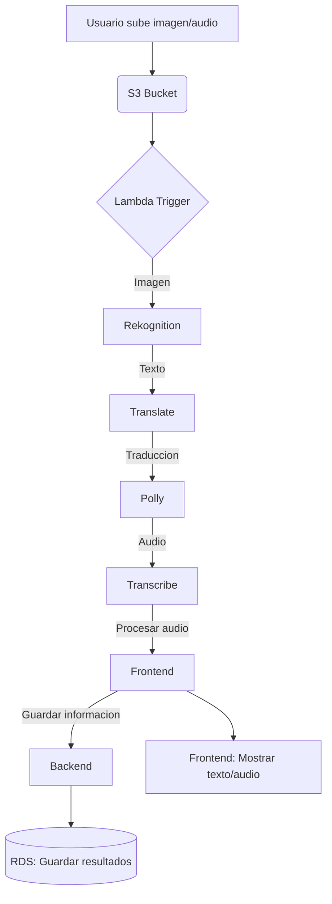

# Manual técnico

## Objetivos

### **Objetivo General**  
Desarrollar una plataforma innovadora llamada **LinguaVision** que aproveche los servicios de AWS para ofrecer traducción y conversión de texto a voz a partir de imágenes, facilitando la accesibilidad y comunicación multilingüe en tiempo real.  

### **Objetivos Específicos**  
1. **Extracción de texto**: Utilizar Amazon Rekognition para identificar y extraer texto de imágenes (carteles, menús, documentos).  
2. **Traducción automática**: Integrar Amazon Translate para convertir el texto extraído a múltiples idiomas.  
3. **Conversión a voz**: Emplear Amazon Polly para generar archivos de audio con el texto traducido.  
4. **Procesamiento de audio (servicio extra)**: Incorporar Amazon Transcribe para transcribir audio a texto y luego traducirlo.  
5. **Escalabilidad y seguridad**: Implementar una arquitectura robusta con EC2, S3, Load Balancer, Cognito y API Gateway para garantizar disponibilidad y protección de datos.  

## Descripción

### **Descripción del Proyecto**  
**LinguaVision** es una plataforma SaaS diseñada para:  
- **Turistas**: Traducir menús, señales o información pública en tiempo real.  
- **Empresas**: Digitalizar documentos multilingües (facturas, contratos) y generar versiones auditivas.  
- **Profesionales**: Procesar contenido multimedia (imágenes/audio) para reuniones o proyectos internacionales.  

**Flujo del sistema**:  
1. **Subida de imágenes**: Los usuarios cargan archivos mediante una interfaz web/móvil (almacenados en S3).  
2. **Procesamiento con AWS**:  
   - Rekognition extrae texto de imágenes.  
   - Transcribe convierte audio a texto (servicio extra).  
   - Translate traduce el texto al idioma deseado.  
   - Polly genera voz sintetizada a partir del texto traducido.  
3. **Entrega de resultados**: Los usuarios reciben el texto traducido y/o el audio en su panel de control.  

## Arquitectura implementada

## Presupuesto

| **Servicio AWS**       | **Costo Estimado (mensual)** | **Justificación**                                                                 |  
|------------------------|-----------------------------|-----------------------------------------------------------------------------------|  
| **EC2**                | $20 - $50                   | Hosting de la aplicación web con instancias t3.micro (dependiendo del tráfico).   |  
| **S3**                 | $5 - $10                    | Almacenamiento de imágenes, audios y resultados (primeros 50 GB gratuitos).       |  
| **Load Balancer**      | $18                         | Distribución de carga para alta disponibilidad (precio fijo por hora).            |  
| **Lambda**             | $1 - $5                     | Ejecución de funciones sin servidor (bajo costo por solicitudes).                 |  
| **RDS (PostgreSQL)**   | $15 - $30                   | Base de datos para usuarios y registros de traducciones (instancia t4g.micro).    |  
| **Cognito**            | $0 - $5                     | Autenticación de usuarios (primeros 50,000 MAUs gratuitos).                       |  
| **API Gateway**        | $3 - $10                    | Gestión de APIs (costo por millón de solicitudes).                                |  
| **Rekognition**        | $1 - $10                    | Procesamiento de imágenes (primeros 1,000 análisis gratuitos).                    |  
| **Translate**          | $5 - $20                    | Traducción de texto (costo por caracter).                                         |  
| **Polly**              | $4 - $15                    | Síntesis de voz (primeros 5 millones de caracteres gratuitos).                    |  
| **Transcribe**         | $5 - $15                    | Transcripción de audio (servicio extra, costo por minuto procesado).              |  
| **Total Estimado**     | **$80 - $190**              | |  

### **Descripción Detallada de los Servicios Utilizados en LinguaVision**

---

#### **1. Servicios Básicos**  

##### **Amazon EC2 (Elastic Compute Cloud)**  
- **Función**: Hosting de la aplicación web y backend.  
- **Configuración**:  
  - Instancias `t3.micro` (costo-eficientes para desarrollo).  
  - Escalado automático para manejar picos de tráfico (ej: turistas en temporada alta).  
- **Beneficios**:  
  - Flexibilidad para elegir sistemas operativos (Linux/Windows).  
  - Integración con Elastic Load Balancer para alta disponibilidad.  

##### **Amazon S3 (Simple Storage Service)**  
- **Función**: Almacenar imágenes subidas por usuarios, audios procesados y resultados (texto traducido, archivos de voz).  
- **Configuración**:  
  - Buckets separados para: `uploads`, `processed-text`, `audio-outputs`.  
  - Políticas de lifecycle para archivar/eliminar datos antiguos automáticamente.  
- **Beneficios**:  
  - 99.999999999% de durabilidad.  
  - Acceso rápido mediante URLs pre-firmadas.  

##### **Elastic Load Balancer (ELB)**  
- **Función**: Distribuir tráfico entre múltiples instancias EC2.  
- **Configuración**:  
  - Balanceador de carga de aplicación (ALB) para rutear solicitudes HTTP/HTTPS.  
  - Health checks para eliminar instancias con fallos.  
- **Beneficios**:  
  - Tolerancia a fallos (si una instancia falla, el tráfico se redirige).  
  - Soporte para SSL/TLS (seguridad en transmisión de datos).  

##### **Amazon RDS (Relational Database Service)**  
- **Función**: Almacenar datos estructurados (usuarios, historial de traducciones, metadatos).  
- **Configuración**:  
  - Motor PostgreSQL en una instancia `db.t4g.micro` (gratis en tier free).  
  - Copias de seguridad automáticas y replicación en múltiples AZ.  
- **Beneficios**:  
  - Compatibilidad con SQL para consultas complejas (ej: filtrar traducciones por fecha).  
  - Encriptación de datos en reposo y tránsito.  

**Diagrama de la base de datos implementada**

---

#### **2. Servicios Obligatorios**  

##### **Amazon Cognito**  
- **Función**: Autenticación segura de usuarios (registro/inicio de sesión).  
- **Configuración**:  
  - User Pools para gestión de cuentas (email/contraseña o redes sociales).  
  - Identity Pools para permisos temporales a recursos AWS (ej: acceso a S3).  
- **Beneficios**:  
  - Cumple con GDPR y HIPAA (importante para manejo de datos sensibles).  
  - MFA (autenticación multifactor) opcional.  

##### **AWS Lambda**  
- **Función**: Ejecutar procesos sin servidor en respuesta a eventos (ej: subida de imágenes a S3).  
- **Configuración**:  
  - Funciones en Python/Node.js para:  
    - Invocar Rekognition al detectar una nueva imagen en S3.  
    - Llamar a Translate y Polly una vez extraído el texto.  
  - Timeout ajustado a 3 minutos (suficiente para procesamiento).  
- **Beneficios**:  
  - Costo por milisegundo de ejecución (ahorro vs. servidores siempre activos).  
  - Escalado automático bajo demanda.  

##### **Amazon API Gateway**  
- **Función**: Crear APIs RESTful para conectar el frontend (web/móvil) con los servicios AWS.  
- **Configuración**:  
  - Endpoints para: `/upload-image`, `/get-translation`, `/download-audio`.  
  - Autorización mediante Cognito para proteger las APIs.  
- **Beneficios**:  
  - Throttling para prevenir ataques DDoS.  
  - Cache de respuestas para mejorar velocidad.  

---

#### **3. Servicios Avanzados**  

##### **Amazon Rekognition**  
- **Función**: Extraer texto de imágenes (OCR) y detectar idioma original.  
- **Flujo de trabajo**:  
  1. Lambda invoca Rekognition al subir una imagen a S3.  
  2. Devuelve coordenadas y contenido del texto detectado (ej: "Café $2.50").  
- **Beneficios**:  
  - Soporta 50+ idiomas en texto impreso/manuscrito.  
  - Procesamiento en segundos (ideal para menús o carteles).  

##### **Amazon Translate**  
- **Función**: Traducir texto a +75 idiomas (inglés → español, francés → chino, etc.).  
- **Configuración**:  
  - Personalización con glossaries (ej: términos médicos o legales).  
- **Beneficios**:  
  - Traducción contextual (mejor que Google Translate para jerga técnica).  
  - Integración directa con Lambda.  

##### **Amazon Polly**  
- **Función**: Convertir texto traducido en voz natural.  
- **Configuración**:  
  - Voces realistas como "Lupe" (español) o "Matthew" (inglés).  
  - Formatos de salida: MP3 o OGG.  
- **Beneficios**:  
  - Ajuste de velocidad/tono para claridad.  
  - 60 voces en 30 idiomas.  

---

#### **4. Servicio Extra: Amazon Transcribe**  
- **Función**: Transcripción de audio a texto (para integrar grabaciones al flujo de traducción).  
- **Casos de uso**:  
  - Turistas que graban anuncios en otro idioma.  
  - Empresas que procesan reuniones grabadas.  
- **Configuración**:  
  - Identificación automática de idioma.  
  - Filtrado de palabras inapropiadas (opcional).  
- **Justificación**:  
  - Diferenciación competitiva (pocos proyectos usan audio como input).  
  - Amplía el mercado a usuarios con necesidades auditivas.  

---

### **Diagrama de Flujo de Servicios**  

**Nota**: Todos los servicios están enlazados mediante IAM roles con permisos mínimos necesarios (principio de least privilege).