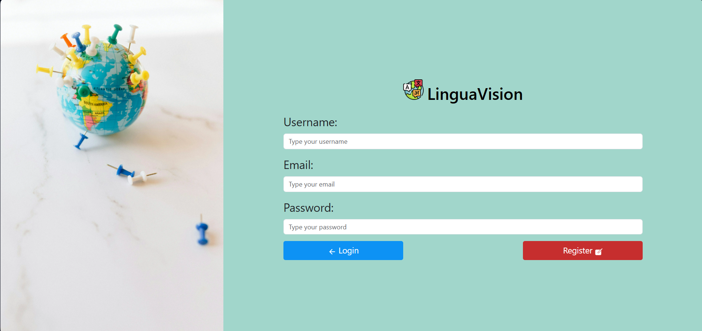
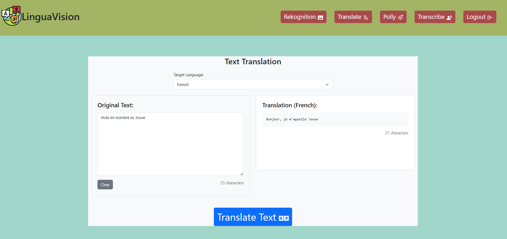
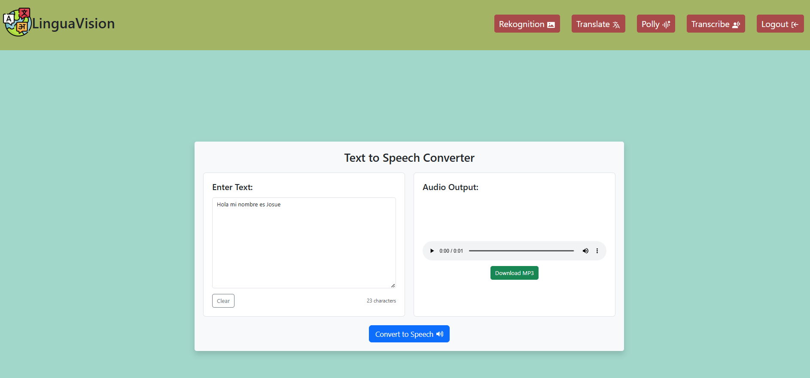

# **Manual de Usuario: LinguaVision**  

## **1. Objetivos del Manual**  
Este documento tiene como objetivo:  
- Explicar las funcionalidades de **LinguaVision**.  
- Guiar a los usuarios paso a paso en el uso de la plataforma.  
- Proporcionar capturas de pantalla para facilitar la navegación.  

---

## **2. Breve Descripción de la Aplicación**  
**LinguaVision** es una plataforma que permite:  
- **Traducir texto en imágenes** (carteles, menús, documentos) a múltiples idiomas.  
- **Convertir texto a voz** en el idioma deseado.  
- **Procesar archivos de audio** (grabaciones) para transcribirlos y traducirlos.  

**Público objetivo**:  
- Turistas, empresas multilingües, profesionales que trabajan con contenido internacional.  

---

## **3. Uso de la Aplicación**  

### **Registro e Inicio de Sesión**  
1. Accede a la página web de LinguaVision.  
2. Haz clic en **"Registrarse"** si eres nuevo o **"Iniciar Sesión"** si ya tienes una cuenta.  
3. Completa el formulario con tu correo y contraseña (o usa Google/Facebook con Amazon Cognito).  

**LOGIN**

**REGISTRO**

---

### **Adquirir texto de imagen**  
1. En el dashboard, selecciona **"Rekognition"**.  
2. Sube la imagen
3. Haz clic en **"Procesar"**.  

---

### **Traducir texto**  
1. En el dashboard, selecciona **"Translate"**.  
2. Elige el idioma al que deseas traducir el texto (ej: español → inglés).  
3. Ingresa el texto.
4. Confirma con **"Traducir"**.  

---

### **Generar audio y descargarlo**  
1. En el dashboard, selecciona **"Polly"**.
2. Ingresa el texto y haz click en procesar.
3. Da click en reproducir y si deseas en el boton "Descargar audio".    

---

### **Extraer texto de audio**  
1. En el dashboard, selecciona **"Transcribe"**.
2. Ingresa el audio y haz click en procesar.

---

## **4. Soporte Técnico**  
Si encuentras problemas:  
- Contacta al equipo en: **soporte@linguavision.com**.  
- Consulta el **Manual Técnico** para detalles de integración con AWS.  

**¡Gracias por usar LinguaVision!** 🌍🔊  

--- 

**Nota**: Las capturas de pantalla son ilustrativas. En la implementación real, se incluirán imágenes reales de la interfaz.