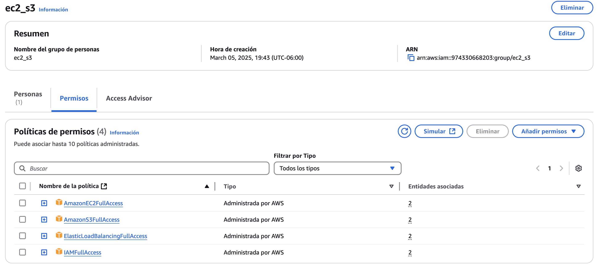
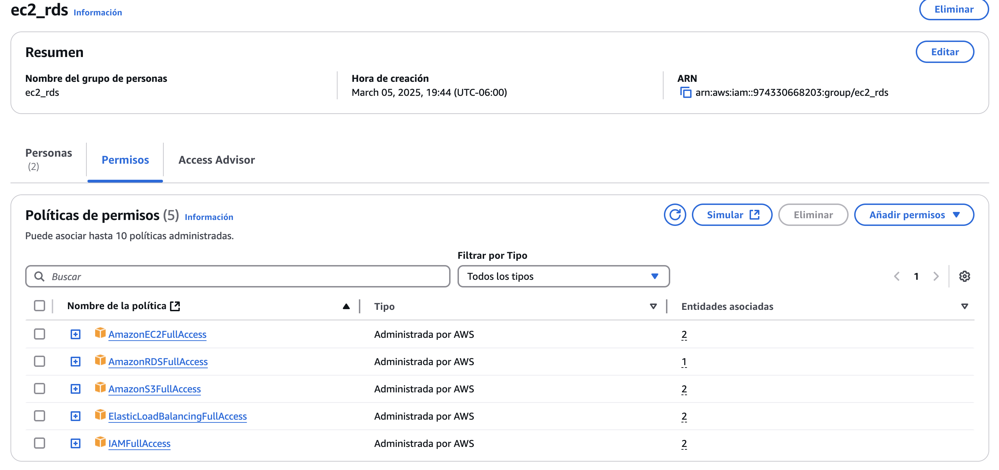
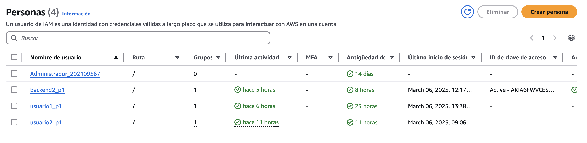
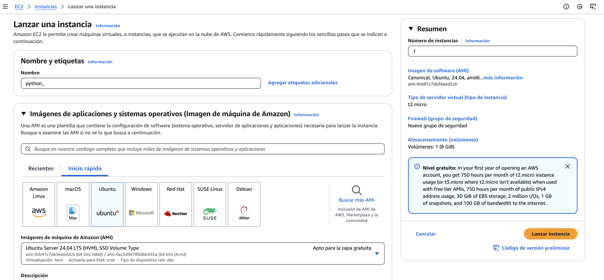
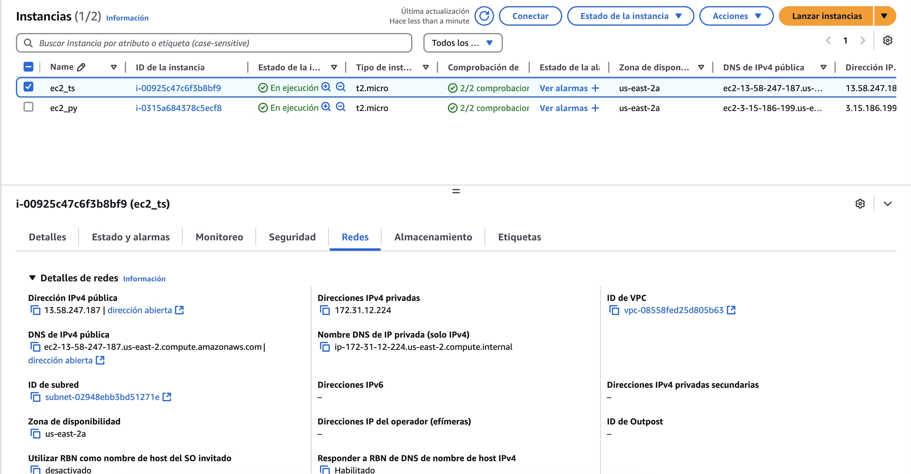
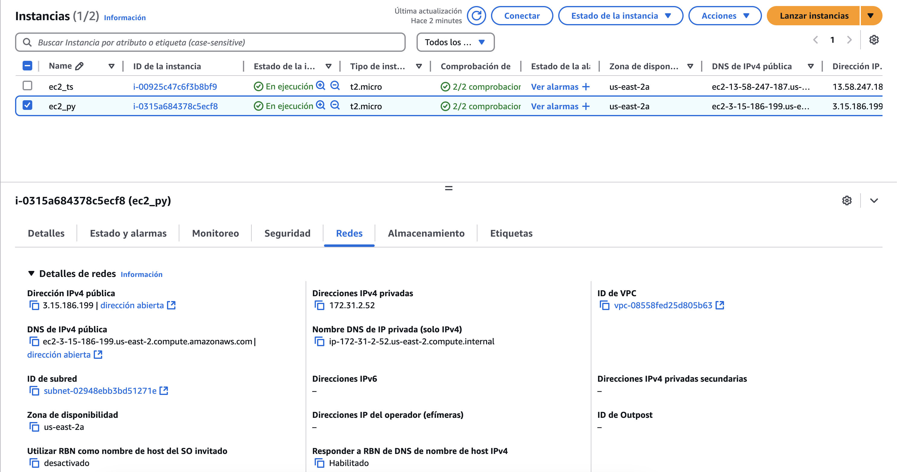
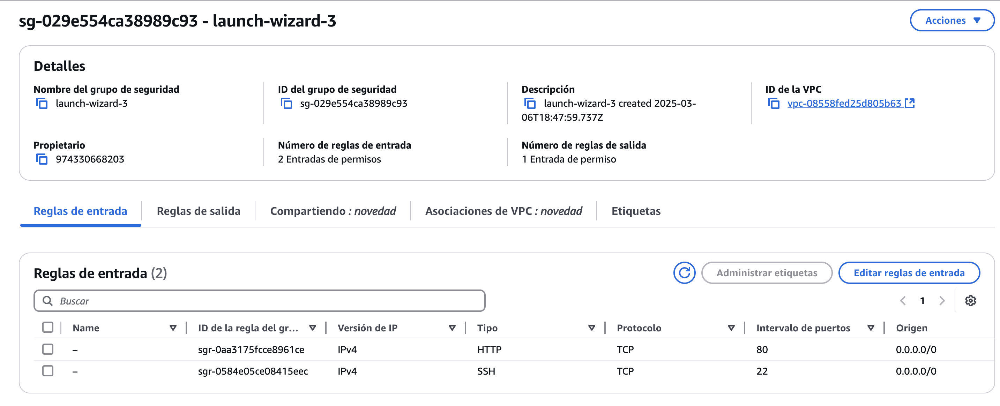
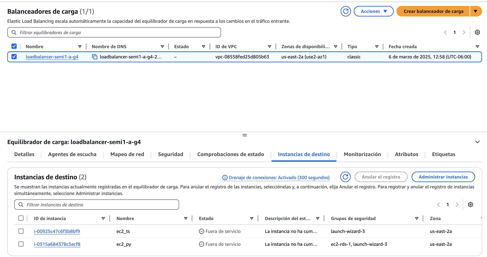

# Manual Técnico

## Objetivos
## Explicación de Arquitectura del proyecto.
## Diagrama Entidad Relación
## Descripción de cada usuario de IAM creado con las políticas asociadas.

### Grupos de seguridad

#### **ec2_s3** 
Se creo un grupo de politicias las cuales tienen acceso completo a:
1. EC2
2. S3
3. Elastic Load Balancer

#### **ec2_rds**
Se creo un grupo de políticas las cuales tienen acceso completo a:
1. EC2
2. RDS
3. S3
4. Load Balancer

### Usuarios de IAM

Se cuenta con tres usuarios que comparten grupos de políticas:

1. backend2_p1 
   1. Comparte el grupo de políticia **ec2_rds**
2. usuario1_p1
   1. Comparte el grupo de política **ec2_s3**
3. usuario2_p1
   1. Comparte el grupo de politica **ec2_rds**

## Capturas y descripción de cómo se configuró cada servicio.

### Configuración de las EC2 para las instancias de lso servicios backend

1. Se crearon dos instancias en EC2, utilizando Ubuntu como SO y todas opciones de las capa gratuita.
   
   
    
2. Se configuraron los accesos de red para disponer hacia todas las máquinas el puerto **3001**, donde los servicios de python y node_js se están ejecutando. 
   

### Configuración del Load Balanacer
Se configuró un Load Balancer el cual tiene atada las dos intancias EC2 que se crearon para cada servicio estas, están unidas por el mismo puerto **3001**.

## Conclusiones